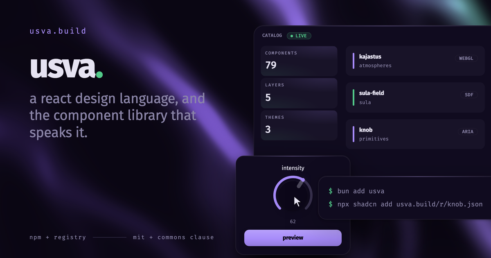

# usva.

**beauty that stays usable.**

a React design language in three themes. kajo is atmospheric and dark, for work that has to be
looked at. sisu is dense and quick, for work that has to be used. savi is the light ground. one
token vocabulary sits under all three, so a surface can move between them without turning into a
different system.

shaped by two live apps, which is the only reason anything is in here. a component earns its place
by already working in something that shipped.

[](https://www.npmjs.com/package/usva)
[](LICENSE.md)
[](https://github.com/matt-pasek/usva/actions/workflows/ci.yml)

**[usva.build](https://usva.build)** · [get started](https://usva.build/docs/get-started) · [design language](https://usva.build/design-language)

## two ways in

every component ships both ways, and you pick per component rather than per project.

own it, and the source lands in your repo to fork as you like. it is generated from the same code
that builds the package, never hand-maintained beside it.

```sh
npx shadcn add https://usva.build/r/button.json
bun add usva-tokens
```

or install it, and the package stays the source of truth. `bun update` carries fixes to you.

```sh
bun add usva usva-tokens
```

> [!NOTE]
> `usva-tokens` is on npm. `usva` is not there yet, so the registry is the way in today.

take `dialog` from the package because you will never touch it. copy `stat-card` in because you
always do. mixing them is the point.

## setup

Tailwind v4. in your global stylesheet:

```css
@import "tailwindcss";
@import "usva-tokens/theme.css";
@import "usva-tokens/themes/kajo.css";
@import "usva-tokens/roles-safelist.css";
@source "../node_modules/usva/dist/**/*.js";
```

that last line is not optional. without it Tailwind never sees the classes that live only inside
usva's own components, and every overlay renders unpositioned. the build stays green while it
happens, because a missing class is not a compile error.

then import from the component's own path, never the package root:

```tsx
import { Button } from "usva/primitives/button";
```

full setup, including the theme switch, is at
[usva.build/docs/get-started/installation](https://usva.build/docs/get-started/installation).

## what's here

| | |
|---|---|
| `packages/usva` | the components. 36 primitives, 27 patterns, 8 atmospheres, 6 sula surfaces, 2 motion helpers. |
| `packages/tokens` | semantic roles, the three themes, the DTCG and Tokens Studio exports for Figma. |
| `packages/cli` | builds the registry JSON the docs site serves. private. |
| `apps/docs` | usva.build. |

bun workspaces and Turborepo. `bun run build`, `bun run test`, `bun run typecheck`, `bun run lint`.

## the three themes

not three palettes sharing a prefix. the same roles resolved three ways, including timing: kajo is
languid at 220ms, sisu is quick at 160ms, savi sits at 200ms in between. a theme is a whole posture,
not a colour swap.

switch with `data-theme` on any element, not only on `<html>`. scoping a theme to a subtree works.

## license

MIT with the Commons Clause. fork it, change it, ship it inside whatever you are building,
commercially or not. do not sell the components themselves, alone or in a bundle or as a port.

[LICENSE.md](LICENSE.md).

## more

[PRODUCT.md](PRODUCT.md) is what usva. is for and what it refuses to be. [DESIGN.md](DESIGN.md) is
the design language itself. [CONTRIBUTING.md](CONTRIBUTING.md) covers what gets merged.

built by [matt-pasek](https://matt-pasek.dev).
